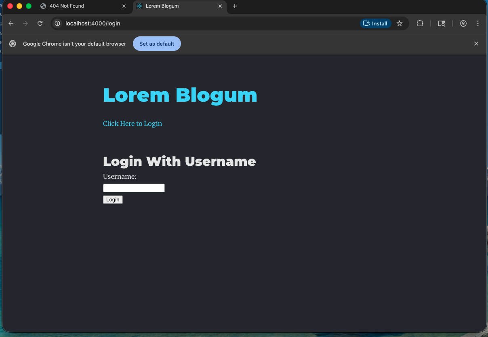

## Authentication Features

This application supports basic user authentication using Flask sessions.

### Features
- Log in with a username
- Log out
- Session persists after page refresh

### Screenshots

#### Logged In
